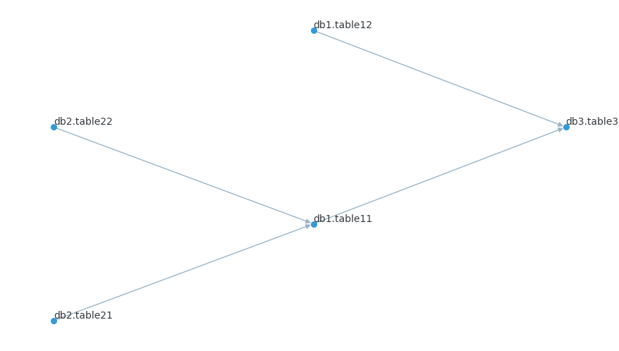

## 太长不看，说重点

如果你有以下烦恼：
1. 你希望做一个前后端分离的Python Web项目，后端只写REST接口，前端通过React或者Vue来开发
2. 你希望部署的时候，前后端不分离。前端npm run build完的HTML/CSS/JavaScript静态文件，通过Python Web框架来Serve
3. 部署时前后端不分离的一个重要原因，是因为你要做一个Python Package，通过setup.py来打包，最终打好的whl包可以发布到PyPI。
   需要的人pip install一下就可以装上

那么这篇博客可能会对你有帮助。

## 业界趋势

传统来说，Python世界的数据可视化方案可以分为两大流派。一派是科学计算阵营，以matplotlib为典型代表的服务端绘图方案：终端用户通常在Jupyter 
Notebook中，编写短短几行Python代码即可获得图片形式的绘图结果。易用性的优势显而易见，开发人员和用户，都只需要了解Python即可。但与此同时，
由于输出是图片，就无法实现比如悬停提示，拖拽变更等用户交互功能。

与之对应的，另一派则是Web开发阵营，HTML/CSS/JavaScript的客户端绘图方案。这种方案具有天然的可交互优势，但长期以来，缺点也很明显，
主流的Python Web框架所提供的视图层解决方案是HTML模板（比如[Django Template](https://docs.djangoproject.com/zh-hans/3.2/topics/templates/), 
Flask生态下常用的[Jinja2](https://jinja.palletsprojects.com/en/3.0.x/)）。所谓模板，可以简单认为就是字符串拼接，
通过Python代码来动态传入变量，生成静态的HTML + CSS + JavaScript）。在这个过程中，生成的JavaScript配合模板渲染好的HTML，提供一定程度的用户交互。
即便对于一个熟练的Python Web开发来说，整个过程也不可谓不别扭，毕竟交互的核心逻辑其实还是JavaScript来实现的。

与此同时，前端社区这些年来发展一直很迅猛，前后端分离已经是既成事实。如今更为现实的选择，是将整个前端解决方案，让渡给NodeJS/npm，享受丰富的前端生态。
后端开发语言，无论是Python也好，Java亦或是Go，只提供REST接口就可以了。

## 项目背景

[sqllineage](https://github.com/reata/sqllineage) 是我开发的一个SQL血缘解析库。用户传入一个多语句的SQL文本，sqllineage可以解析出所有的输入表和输出表，
并以有向无环图DAG的形式，进行可视化展示。



在1.0版本的sqllineage中，血缘图可视化是通过matplotlib + graphviz来实现的。graphviz是一个C写的绘图库，但这里我没有用到其绘图功能，
只是调用了一个dot函数，获得图的布局数据（简单说就是所有节点的坐标，每个点应该画在哪里），然后传回给matplotlib进行绘制。
```python
def draw_lineage_graph(graph: DiGraph) -> None:
    try:
        import matplotlib.pyplot as plt
        from matplotlib.colors import colorConverter
        from matplotlib.patches import FancyArrowPatch
        from matplotlib.path import Path
    except ImportError as e:
        raise ImportError("Matplotlib required for draw()") from e
    except RuntimeError:
        logger.error("Matplotlib unable to open display")
        raise
    try:
        import pygraphviz  # noqa
    except ImportError as e:
        raise ImportError("requires pygraphviz") from e
    pos = nx.nx_agraph.graphviz_layout(graph, prog="dot", args="-Grankdir='LR'")
    edge_color, node_color, font_color = "#9ab5c7", "#3499d9", "#35393e"
    arrowsize = font_size = radius = 10
    node_size = 30
    ha, va = "left", "bottom"
    nx.draw(
        graph,
        pos=pos,
        with_labels=True,
        edge_color=edge_color,
        arrowsize=arrowsize,
        node_color=node_color,
        node_size=node_size,
        font_color=font_color,
        font_size=font_size,
        horizontalalignment=ha,
        verticalalignment=va,
    )
    # selfloop edges
    for edge in nx.selfloop_edges(graph):
        x, y = pos[edge[0]]
        arrow = FancyArrowPatch(
            path=Path.circle((x, y + radius), radius),
            arrowstyle="-|>",
            color=colorConverter.to_rgba_array(edge_color)[0],
            mutation_scale=arrowsize,
            linewidth=1.0,
            zorder=1,
        )
        plt.gca().add_patch(arrow)
    plt.show()
```
完整的代码参见[这里](https://github.com/reata/sqllineage/blob/v1.0.2/sqllineage/drawing.py) 。

这个方案实现了我的初步需求，但也带来了一些制约，比如
- graphviz是一个C库，在Windows上安装较为繁琐。经常有用户和我抱怨，pip install sqllineage已经成功了，但是绘图功能用不了。我看了之后，
  通常是graphviz本身没装成功，或者pygraphviz，这个Python调用C的绑定库安装没成功。
- 当节点非常多非常密集的时候，用户没有办法手动介入去拖动来调整图的布局。
- 我后续想做一些更好的交互，比如用户鼠标悬停在某张表上，所有这张表的上游和下游表以及相关的边高亮。尤其当字段级别的血缘功能完成后，
  会有更多定制化的可视化需求，这时候JS的图可视化生态的优势会更大。

于是我决定，在1.1版本中，把它改成JavaScript来绘图，Web的解决方案一劳永逸，不用再担心操作系统的兼容问题。之前的 `draw_lineage_graph`
这个函数弹出matplotlib的绘图，如今改为调用Flask，启动一个Web服务。这个Web Server的根路径，用GET方法调用时，返回index.html。
index.html，以及它关联的所有css和javascript文件，是通过前端npm run build打包出来的。用POST方法调用时，入参是SQL脚本的路径，
则会返回JSON形式表示的DAG数据结构。
```python
app = Flask(
    __name__,
    static_url_path="",
    static_folder=os.path.join(os.path.dirname(__file__), STATIC_FOLDRE),
)
CORS(app)


@app.route("/")
def index():
    return app.send_static_file("index.html")


@app.route("/lineage", methods=["POST"])
def lineage():
    # this is to avoid circular import
    from sqllineage.runner import LineageRunner

    req_args = Namespace(**request.get_json())
    sql = extract_sql_from_args(req_args)
    resp = LineageRunner(sql).to_cytoscape()
    return jsonify(resp)


cli = sys.modules["flask.cli"]
cli.show_server_banner = lambda *x: None  # type: ignore


def draw_lineage_graph(**kwargs) -> None:
    port = kwargs.pop("p", DEFAULT_PORT)
    querystring = urlencode({k: v for k, v in kwargs.items() if v})
    print(f" * SQLLineage Running on http://localhost:{port}/?{querystring}")
    app.run(port=port)
```
完整的代码参见[这里](https://github.com/reata/sqllineage/blob/v1.1.4/sqllineage/drawing.py)。

前端工程单独放在[sqllineagejs](https://github.com/reata/sqllineage/tree/v1.1.4/sqllineagejs) 这个目录下，
是一个标准的通过npm来开发和构建的前端项目，通过`npm run build`就可以打包出相应的HTML/CSS/JavaScript文件，内部调用的是create-react-app脚本，
这里不多赘述。

到这里，如果是本地开发，或者当做普通的application部署到服务器上，那么一切问题都搞定了。Flask的app.run()，就会启动相应的Server，
部署时前后端代码不分离。即使对性能有要求的话，也依然支持将Flask应用通过gunicorn或者uwsgi来做部署，然后用专用的Web Server（比如Nginx）来Serve静态文件。

但是，我需要发布的，是一个PyPI Package，这带来了额外的工作量。

## 打包静态文件到Python Package

目前Python社区的主流做法，是通过wheel这个库，调用python setup.py bdist_wheel命令，构建出一个whl包。这个包可以上传到PyPI，
也可以离线分享并直接通过pip安装。我们需要搞定的问题，就是把静态文件，加入到这个whl包里。

要达成这个目标，有各种各样的办法。但我有一个最主要的设计原则：**Python项目是通过setuptools构建的，JavaScript项目是通过npm构建的。我不希望再额外写一个shell脚本，包装两个构建系统**。
考虑到我这个项目，主要是Python项目，我希望依然可以通过setuptools来构建。

其次，我希望用户可以通过`pip install git+https://github.com/reata/sqllineage.git`直接从GitHub仓库进行源码安装。

注意这两种安装方式有显著的不同：通过PyPI（的whl文件）安装或者直接离线安装whl文件，前端静态文件是处于已经构建好的状态，被打包在whl中，
用户不需要在本地准备NodeJS/npm环境。而对于源码安装，前端代码是在用户本地环境构建的。想象一个带有C扩展的Python Package，
源码安装时需要本地的编译环境，也是类似的情况。

为了达成上面这些目标，需要进行下面这些配置：

### package_data
默认setup.py的构建只会包含package内所有的Python文件。如果你需要在最终构建的程序包中包含非Python文件，那么需要通过
package_data来指定，它的值是一个键值对，键是包名，值是包含数据文件的所有相对路径的列表。注意这里的相对路径是无法递归包含里面的子目录的。
而典型的npm run build出来的目录结构如下：
```
build
  - static
    - css
      *.chunk.css
    - js
      *.chunk.js
  favicon.ico
  index.html
  manifest.json
  robots.txt
```
所以我指定了两层相对路径为：
```
package_data={"": [f"build/*", f"build/**/**/*"]}
```

可参考[官方文档](https://docs.python.org/3/distutils/setupscript.html#installing-package-data)

### cmdclass

cmdclass是setuptools提供的hook，通过覆盖相应的cmdclass，可以定制化地插入相应的代码，比如这里我们需要的调用npm构建前端代码。
可参考[官方文档](https://docs.python.org/3/distutils/extending.html) 。由于我们既要保证whl类型的安装，也要保证源码tar.gz的安装。
于是我们需要覆盖的hook，应该是bdist_wheel和sdist的交集：

简单测试一下可知，二者都会调用egg_info这个hook：
```shell
$ python setup.py bdist_wheel | grep running
running bdist_wheel
running build
running build_py
running egg_info
running install
running install_lib
running install_egg_info
running install_scripts
$ python setup.py sdist | grep running
running sdist
running egg_info
running check
```

那么覆盖的代码如下：
```python
class EggInfoWithJS(egg_info):
    """
    egginfo is a hook both for
        1) building source code distribution (python setup.py sdist)
        2) building wheel distribution (python setup.py bdist_wheel)
        3) installing from source code (python setup.py install) or pip install from GitHub
    In this step, frontend code will be built to match MANIFEST.in list so that later the static files will be copied to
    site-packages correctly as package_data. When building a distribution, no building process is needed at install time
    """

    def run(self) -> None:
        static_path = os.path.join(NAME, STATIC_FOLDRE)
        if os.path.exists(static_path) or "READTHEDOCS" in os.environ:
            pass
        else:
            js_path = "sqllineagejs"
            use_shell = True if platform.system() == "Windows" else False
            subprocess.check_call(
                shlex.split("npm install"), cwd=js_path, shell=use_shell
            )
            subprocess.check_call(
                shlex.split("npm run build"), cwd=js_path, shell=use_shell
            )
            shutil.move(os.path.join(js_path, STATIC_FOLDRE), static_path)
        super().run()


setup(
    ...
    packages=find_packages(exclude=("tests",)),
    package_data={"": [f"{STATIC_FOLDRE}/*", f"{STATIC_FOLDRE}/**/**/*"]},
    cmdclass={"egg_info": EggInfoWithJS},
)
```

这里有几点值得注意的：
- windows下不认环境变量，所以调用subprocess时，需要指定shell=True，否则找不到npm命令
- 默认打包好的前端静态文件在sqllineagejs/build目录下，构建完成后，我们手动将其移动到sqllineage/build
- 如果sqllineage/build文件夹存在，那么将会跳过前端构建过程。因为前端代码构建速度比较慢，本地没必要重复执行。而真正发布时，是在GitHub Action的CI机器上执行的，
  每次都是重新拉取代码，不会有跳过构建的情况。（另一个例外情况是构建READTHEDOCS文档时，对应的环境没有npm，此时我们也不需要构建前端代码）

参见最终完整版的[setup.py](https://github.com/reata/sqllineage/blob/v1.1.4/setup.py)。到这里，我们成功实现了，
在构建Python Package时打包前端代码。是时候告别Python Web模板了，来享受现代化的前端解决方案吧。
